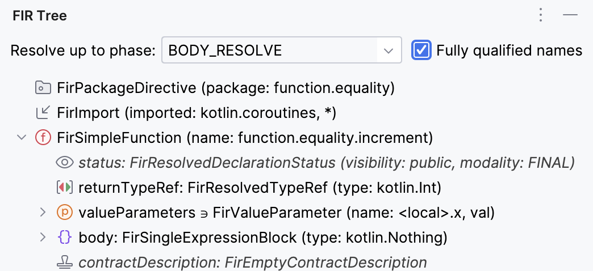

# FIR Tree <iframe width="245px" height="48px" src="https://plugins.jetbrains.com/embeddable/install/23270"></iframe>

> Visualize Kotlin's Frontend Intermediate Representation (FIR) right in your IDE

This plug-in helps you to understand the way the K2 Kotlin compiler represents the code internally.

- Adjustable resolution phase (the last one, `BODY_RESOLVE`, is the default),
- Click on a node in the tree to select it in the editor,
- Non-visible nodes are shown in italics and slightly grayed out.

Here's the outcome for this piece of code, fully resolved.

```kotlin
package function.equality

import kotlinx.coroutines.*

fun increment(x: Int) = x + 1
```

